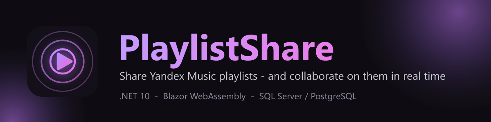

<p align="center">
  
</p>

# PlaylistShare

<p align="center">🌐 <a href="README.md">English</a> - <b>Русский</b></p>

[](https://github.com/jrfrigat/PlaylistShare/actions/workflows/ci.yml)
[](https://github.com/jrfrigat/PlaylistShare/actions/workflows/codeql.yml)
[](LICENSE)
[](https://dotnet.microsoft.com)
[](https://hub.docker.com/r/frigat/playlistshare-api)

**PlaylistShare** позволяет делиться плейлистами **Яндекс Музыки** с теми, у кого нет к ним доступа, и
совместно работать над общим списком треков. Это небольшое full-stack приложение на **.NET 10**: API
на ASP.NET Core и прогрессивное веб-приложение (PWA) на Blazor WebAssembly, упакованные в два
Docker-образа.

> **Неофициальный проект. Не связан с Яндексом.** Обращается к Яндекс Музыке от имени пользователя
> по его учётным данным - используйте на свой риск и соблюдайте условия сервиса.

---

## Возможности

- **Доступ к плейлисту по ссылке** с настройкой прав на каждый доступ (просмотр / прослушивание / добавление / удаление)
- **Совместная работа над списком треков** - добавляйте и удаляйте треки вместе, с журналом того, кто что изменил
- **Поиск по каталогу Яндекса** (треки, альбомы, исполнители, плейлисты)
- **Воспроизведение в браузере** по прямым ссылкам на поток
- **Избранное**, а также ваши понравившиеся и собственные плейлисты
- **Привязка аккаунта Яндекс Музыки** по QR-коду или вставкой access-токена
- **Устанавливаемое PWA** с динамической фиолетовой темой

---

## Архитектура

Три проекта, одно решение (`PlaylistShare.slnx`):

| Проект | Описание |
|--------|----------|
| `src/PlaylistShare.Api` | API на ASP.NET Core - авторизация JWT + ASP.NET Core Identity, EF Core (SQL Server **или** PostgreSQL), интеграция с Яндекс Музыкой, OpenAPI. |
| `src/PlaylistShare.Pwa` | Клиент на Blazor WebAssembly на базе [Flare](https://github.com/jrfrigat/Flare), отдаётся как PWA через nginx. |
| `src/PlaylistShare.Shared` | DTO/контракты, общие для API и клиента. |

Запросы к Яндекс Музыке выполняются через клиент
[YandexMusic](https://github.com/jrfrigat/YandexMusic). Пользователь входит локально по логину и
паролю (JWT), затем привязывает аккаунт Яндекс Музыки по QR-коду или вставкой access-токена.

---

## Начало работы

### Требования

- [.NET 10 SDK](https://dotnet.microsoft.com/)
- `dotnet workload install wasm-tools` (инструменты сборки Blazor WebAssembly)
- SQL Server или PostgreSQL (либо используйте Docker - см. ниже)

### Сборка и запуск

```sh
dotnet restore PlaylistShare.slnx
dotnet build   PlaylistShare.slnx -c Release

# API - документ OpenAPI по адресу /openapi/v1.json
dotnet run --project src/PlaylistShare.Api

# PWA-клиент
dotnet run --project src/PlaylistShare.Pwa
```

API применяет ожидающие миграции EF Core автоматически при запуске (`Database.Migrate()`), поэтому
ручной шаг `dotnet ef database update` не нужен - новая база разворачивается при первом запуске.

---

## Docker

API и PWA поставляются как два образа - в Docker Hub и GitHub Container Registry:

| Образ | Docker Hub | GHCR |
|-------|------------|------|
| API (ASP.NET Core) | `frigat/playlistshare-api` | `ghcr.io/jrfrigat/playlistshare-api` |
| PWA (Blazor WASM, nginx) | `frigat/playlistshare-pwa` | `ghcr.io/jrfrigat/playlistshare-pwa` |

### Весь стек через docker-compose

Самый быстрый способ запустить всё - API, PWA и встроенный PostgreSQL - это небольшой `docker-compose.yml`.
Скопируйте его, поменяйте два секрета (`Jwt__Key` и пароль базы), затем `docker compose up -d`:

```yaml
services:
  db:
    image: postgres:17-alpine
    environment:
      POSTGRES_DB: PlaylistShare
      POSTGRES_USER: playlist
      POSTGRES_PASSWORD: change-me
    volumes:
      - pgdata:/var/lib/postgresql/data
    healthcheck:
      test: ["CMD-SHELL", "pg_isready -U playlist -d PlaylistShare"]
      interval: 10s
      timeout: 5s
      retries: 5

  api:
    image: frigat/playlistshare-api:latest
    depends_on:
      db:
        condition: service_healthy
    environment:
      Database__Provider: Postgres
      ConnectionStrings__DefaultConnection: "Host=db;Port=5432;Database=PlaylistShare;Username=playlist;Password=change-me"
      Jwt__Key: "change-me-to-a-stable-secret-at-least-32-characters"
      DataProtection__KeysPath: /keys
    volumes:
      - dpkeys:/keys
    ports:
      - "7001:8080"

  pwa:
    image: frigat/playlistshare-pwa:latest
    depends_on:
      - api
    ports:
      - "7101:80"

volumes:
  pgdata:
  dpkeys:
```

```sh
docker compose up -d
# PWA:  http://localhost:7101
# API:  http://localhost:7001   (документ OpenAPI по /openapi/v1.json)
```

API применяет миграции EF Core при старте, поэтому база разворачивается сама при первом запуске. Чтобы
использовать SQL Server вместо встроенного PostgreSQL, уберите сервис `db`, задайте
`Database__Provider=SqlServer` и направьте `ConnectionStrings__DefaultConnection` на ваш MS SQL Server.

> Важно: PWA обращается к API по адресу, зашитому в её `wwwroot/appsettings.json` (`ApiBaseUrl`); в
> опубликованном образе это домен проекта. Чтобы хостить PWA на своём домене, отдавайте API с того же
> origin за обратным прокси (и добавьте этот origin в `Cors:Origins`) либо пересоберите образ PWA из
> исходников со своим `ApiBaseUrl`.

### Только API

Образ API самодостаточен и настраивается целиком через переменные окружения (слушает порт контейнера
`8080`):

```sh
docker run -p 7001:8080 \
  -e ConnectionStrings__DefaultConnection="Server=host.docker.internal;Database=PlaylistShare;User Id=sa;Password=...;TrustServerCertificate=True" \
  -e Jwt__Key="change-me-to-a-stable-secret-at-least-32-characters" \
  -e Database__Provider=SqlServer \
  -v playlistshare-keys:/keys -e DataProtection__KeysPath=/keys \
  frigat/playlistshare-api:latest
# API на http://localhost:7001
```

### Из исходников

Для разработки или чтобы собрать оба образа со своей конфигурацией, используйте compose-файлы из этого
репозитория. `run-docker-compose.bat` накладывает `docker-compose.prod.yml` (секреты из git-игнорируемого
`.env` и постоянный том для ключей Data Protection) поверх базового `docker-compose.yml`:

```sh
cp .env.example .env      # затем отредактируйте .env
run-docker-compose.bat    # docker compose -f docker-compose.yml -f docker-compose.prod.yml up -d --build
```

Варианты базы для сборки из исходников: **SQL Server** (по умолчанию; укажите `CONNECTION_STRING` на
внешний MS SQL Server), **внешний PostgreSQL** (`DB_PROVIDER=Postgres` и соответствующая Npgsql-строка
`CONNECTION_STRING`) или **PostgreSQL в контейнере** через `run-docker-compose-postgres.bat`. Все
переменные - в `.env.example`.

---

## Конфигурация

`src/PlaylistShare.Api/appsettings.json` содержит **только заглушки**. Реальные значения задавайте
через [User Secrets](https://learn.microsoft.com/aspnet/core/security/app-secrets) при разработке или
через переменные окружения в продакшене (форма с двойным подчёркиванием указана в скобках):

| Ключ | Описание |
|------|----------|
| `ConnectionStrings:DefaultConnection` | Строка подключения к базе для активного провайдера. |
| `Jwt:Key` | Ключ подписи JWT (>= 32 символов). |
| `Database:Provider` (`Database__Provider`) | `SqlServer` (по умолчанию) или `Postgres`. |
| `DataProtection:KeysPath` (`DataProtection__KeysPath`) | Каталог для ключей Data Protection - в Docker это смонтированный том, **не** база данных. |
| `Cors:Origins` | Разрешённые источники для PWA. |
| `Client:BaseUrl` | Публичный базовый URL PWA, используется для построения ссылок на плейлисты. |

```sh
cd src/PlaylistShare.Api
dotnet user-secrets set "Jwt:Key" "..."
dotnet user-secrets set "ConnectionStrings:DefaultConnection" "..."
```

**Никогда не коммитьте реальные секреты.** См. [SECURITY.md](SECURITY.md).

---

## Участие в разработке

См. [CONTRIBUTING.md](CONTRIBUTING.md). Баги и предложения - через
[шаблоны issue](https://github.com/jrfrigat/PlaylistShare/issues/new/choose).

---

## Лицензия

MIT (c) 2026 FrigaT
